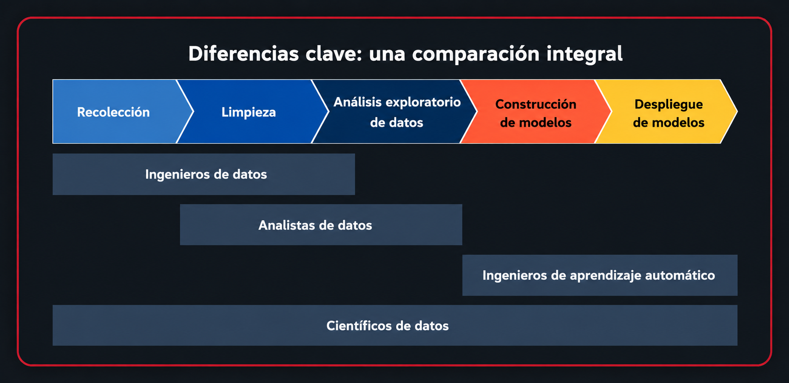

# Diferencia entre Análisis de Datos y Ciencia de Datos

## Introducción

- Los datos son considerados el nuevo petróleo de la economía digital.
- Comprender los datos es fundamental para la innovación y la toma de decisiones.
- Dos disciplinas suelen confundirse:
  - **Análisis de Datos (Data Analytics)**
  - **Ciencia de Datos (Data Science)**
- Aunque comparten fundamentos, tienen objetivos, herramientas y enfoques diferentes.

---

# Análisis de Datos (Data Analytics)

## Definición

El análisis de datos consiste en transformar datos brutos en información útil para comprender situaciones, identificar patrones y apoyar la toma de decisiones.

### Objetivo principal

Responder preguntas como:

- ¿Qué ocurrió?
- ¿Por qué ocurrió?
- ¿Qué podemos aprender del pasado?

---


## Funciones principales

Los analistas de datos:

- Limpian datos.
- Transforman datos.
- Exploran conjuntos de datos.
- Detectan patrones y anomalías.
- Elaboran informes y visualizaciones.
- Generan recomendaciones de negocio.

---

## Herramientas más utilizadas

### Python

#### Pandas

Permite:

- Limpiar datos.
- Filtrar registros.
- Agrupar información.
- Fusionar tablas.
- Trabajar con DataFrames.

#### NumPy

Permite:

- Operaciones matemáticas eficientes.
- Cálculos sobre grandes volúmenes de datos.
- Manipulación de matrices y vectores.

---

### SQL

Se utiliza para:

- Consultar bases de datos.
- Extraer información específica.
- Realizar filtros y agregaciones.

Ejemplo:

```sql
SELECT *
FROM ventas
WHERE fecha BETWEEN '2025-01-01' AND '2025-01-31';
```

---

### Power BI

Permite:

- Crear dashboards interactivos.
- Visualizar tendencias.
- Construir reportes ejecutivos.
- Facilitar la toma de decisiones.

---

## Habilidades clave del Analista de Datos

### Curiosidad

Capacidad para formular preguntas relevantes.

Ejemplos:

- ¿Por qué aumentaron las ventas?
- ¿Qué clientes tienen mayor riesgo de abandono?

---

### Escepticismo

Capacidad para:

- Validar resultados.
- Evitar conclusiones incorrectas.
- Buscar explicaciones alternativas.

---

### Comunicación

Debe poder:

- Explicar resultados técnicos.
- Adaptar mensajes a distintos públicos.
- Convertir datos en recomendaciones accionables.

---

## Ejemplo práctico

### Comercio electrónico

Un analista detecta que ciertos productos venden menos en determinadas regiones.

Acciones posibles:

- Ajustar inventarios.
- Aplicar descuentos.
- Personalizar campañas de marketing.

Resultado:

- Más ventas.
- Menos desperdicio.
- Mayor satisfacción del cliente.

---

# Ciencia de Datos (Data Science)

## Definición

La Ciencia de Datos combina:

- Estadística.
- Programación.
- Aprendizaje automático.
- Matemáticas.
- Conocimiento del negocio.

Su objetivo es construir sistemas inteligentes capaces de aprender, predecir y automatizar decisiones.

---

## Objetivo principal

Responder preguntas como:

- ¿Qué ocurrirá en el futuro?
- ¿Cómo optimizar procesos?
- ¿Podemos automatizar esta tarea?

---

## Funciones principales

Los científicos de datos:

- Construyen modelos predictivos.
- Diseñan algoritmos.
- Implementan soluciones de Machine Learning.
- Automatizan procesos.
- Descubren patrones complejos.

---

## Herramientas más utilizadas

### Machine Learning

#### Scikit-Learn

Permite:

- Clasificación.
- Regresión.
- Clustering.
- Evaluación de modelos.

Ejemplo:

```python
from sklearn.linear_model import LinearRegression

modelo = LinearRegression()
modelo.fit(X_train, y_train)

predicciones = modelo.predict(X_test)
```

---

#### PyTorch

Especializado en:

- Deep Learning.
- Redes neuronales.
- Visión artificial.
- Procesamiento de lenguaje natural (NLP).

---

### Software Estadístico

#### R

Utilizado para:

- Estadística avanzada.
- Investigación científica.
- Visualización de datos.

#### SAS

Frecuente en:

- Finanzas.
- Seguros.
- Investigación clínica.

---

### Plataformas Cloud

#### Azure

Permite:

- Entrenar modelos a gran escala.
- Procesar grandes volúmenes de datos.
- Desplegar modelos en producción.

---

## Habilidades clave del Científico de Datos

### Experimentación

Implica:

- Probar modelos.
- Ajustar parámetros.
- Comparar algoritmos.
- Optimizar resultados.

---

### Matemáticas y Estadística

Conocimientos fundamentales en:

- Probabilidad.
- Estadística inferencial.
- Álgebra lineal.
- Optimización.

---

### Programación

Dominio de:

- Python.
- R.
- Bibliotecas de Machine Learning.
- Automatización de procesos.

---

## Ejemplo práctico

### Sector salud

Un científico de datos desarrolla un modelo capaz de predecir enfermedades utilizando:

- Historial clínico.
- Datos genéticos.
- Estudios médicos.
- Hábitos del paciente.

Beneficios:

- Diagnóstico temprano.
- Medicina personalizada.
- Mejores resultados clínicos.

---

# Comparación Directa



| Aspecto | Análisis de Datos | Ciencia de Datos |
|----------|------------------|------------------|
| Objetivo | Comprender el pasado | Predecir el futuro |
| Pregunta principal | ¿Qué pasó? | ¿Qué pasará? |
| Enfoque | Análisis descriptivo | Modelos predictivos |
| Resultado | Informes y dashboards | Algoritmos y modelos |
| Complejidad | Moderada | Alta |
| Estadística | Básica a intermedia | Avanzada |
| Machine Learning | Opcional | Fundamental |
| Programación | Importante | Muy importante |
| Automatización | Limitada | Amplia |
| Matemáticas | Básicas | Avanzadas |

---

# Herramientas Comparadas

| Área | Análisis de Datos | Ciencia de Datos |
|--------|-----------------|------------------|
| Lenguaje | Python, SQL | Python, R |
| Datos | Pandas, NumPy | Pandas, NumPy |
| Visualización | Power BI, Tableau | Matplotlib, Plotly |
| Estadística | Básica | Avanzada |
| Machine Learning | Poco frecuente | Fundamental |
| Cloud | Opcional | Muy utilizada |
| Big Data | Ocasional | Frecuente |

---

# Relación entre ambas disciplinas

La Ciencia de Datos se construye sobre los fundamentos del Análisis de Datos.

Flujo típico:

```text
Analista de Datos
        ↓
Análisis Exploratorio (EDA)
        ↓
Estadística
        ↓
Machine Learning
        ↓
Científico de Datos
```

Muchos científicos de datos comenzaron sus carreras como analistas de datos.

---

# ¿Qué camino elegir?

## Elige Análisis de Datos si te gusta:

- Explorar información.
- Crear dashboards.
- Resolver problemas de negocio.
- Comunicar hallazgos.
- Trabajar con SQL y BI.

Posibles roles:

- Data Analyst.
- Business Analyst.
- Marketing Analyst.
- Financial Analyst.

---

## Elige Ciencia de Datos si te gusta:

- Matemáticas.
- Estadística.
- Machine Learning.
- Inteligencia Artificial.
- Construir modelos predictivos.

Posibles roles:

- Data Scientist.
- Machine Learning Engineer.
- AI Engineer.
- Research Scientist.

---

# Conclusiones

- El **Análisis de Datos** se enfoca en comprender el pasado y apoyar decisiones mediante información descriptiva.
- La **Ciencia de Datos** busca predecir comportamientos futuros y automatizar decisiones mediante modelos inteligentes.
- Ambas disciplinas comparten herramientas y conocimientos fundamentales.
- Python es el lenguaje más importante en ambos campos.
- El análisis de datos suele ser la puerta de entrada hacia la ciencia de datos.
- Ambas profesiones tienen alta demanda y ofrecen excelentes oportunidades de crecimiento.